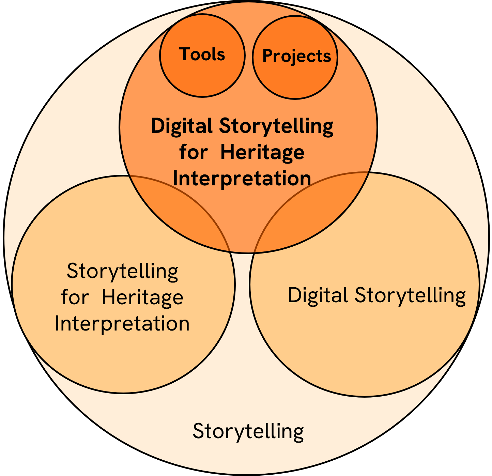
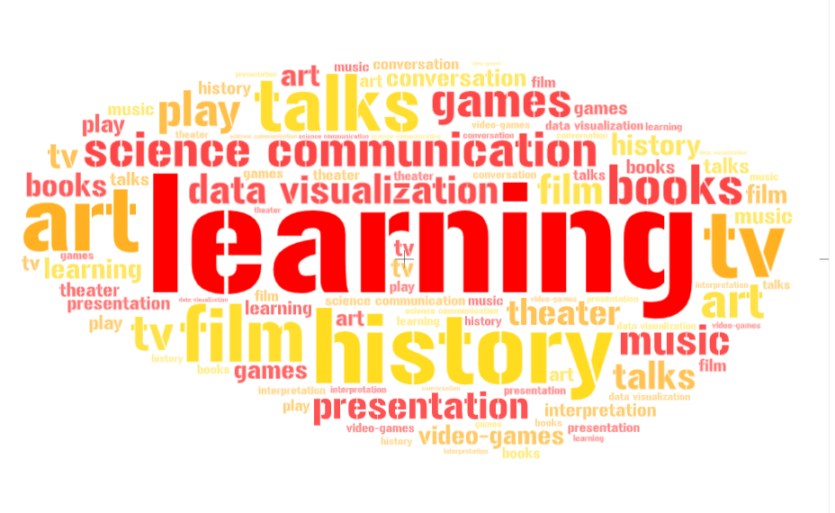
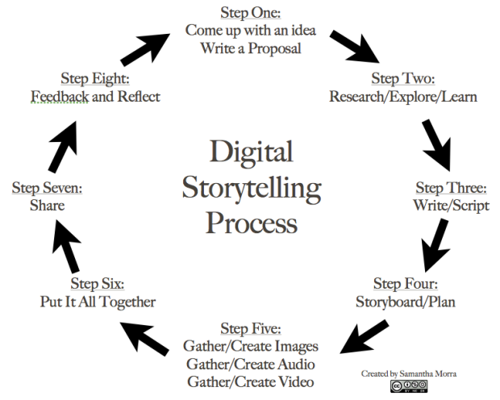

:::::::::::::::::::::::::::::::::::::: questions 

- How can storytelling support the engagement of audiences in a heritage context?

- What are the types of storytelling?

- What tools are available for creating stories in a heritage context?

::::::::::::::::::::::::::::::::::::::::::::::::
::::::::::::::::::::::::::::::::::::: objectives
- To understand the basic concept of storytelling.

- To understand the basic concept of Digital Storytelling.

- To understand the concept of Digital Storytelling in Heritage Interpretation.
:::::::::::::

{alt=''}

## Storytelling as human condition
> "Humans are natural storytellers. It has been THE FORM of passing on knowledge from generation to generation. Storytelling existed in some shape or form in all civilizations across time..."
#### Tolisano, S.R. (2018). Digital Storytelling: What it is… And… What it is NOT. Langwitches.[https://langwitches.org/blog/2015/08/18/digital-storytelling-what-it-is-and-what-it-is-not/](https://langwitches.org/blog/2015/08/18/digital-storytelling-what-it-is-and-what-it-is-not/){target="_blank" rel="noopener"}

>Storytelling "is not just entertainment. Telling stories is a fundamental part of being human".
#### Hennebury, C. (2020). Storytelling is not just entertainment. It's a fundamental part of being human. For CBC.[https://www.cbc.ca/news/canada/newfoundland-labrador/storytelling-is-human-1.5511027](https://www.cbc.ca/news/canada/newfoundland-labrador/storytelling-is-human-1.5511027 ){target="_blank" rel="noopener"}

.jpg){alt=''}

## What is storytelling?

"Storytelling is the social and cultural activity of sharing stories, sometimes with improvisation, theatrics or embellishment.
Every culture has its own stories or narratives, which are shared as a means of entertainment, education, cultural preservation or instilling moral values."
[https://www.beyondintractability.org/essay/narratives](https://www.beyondintractability.org/essay/narratives) 

{alt='campfire'}

## What is the use of storytelling?

Storytelling can be used as a tool for different purposes; however, it goes beyond a simple planned activity to become part of our individual and collective life experience. The uses of storytelling are in fact limitless. 

{alt='words'}

## From analogue to digital

"...Digital Storytelling, has opened up new horizons, inconceivable without the use of technology. Storytelling is evolving, as humans are adapting, experimenting and innovating with the use of ever-changing technology, the growth of human networks and our ability to imagine new paths."

[https://langwitches.org/blog/2015/08/18/digital-storytelling-what-it-is-and-what-it-is-not/](https://langwitches.org/blog/2015/08/18/digital-storytelling-what-it-is-and-what-it-is-not/)
 
{alt=''}

## What is (interactive) digital storytelling?

A definition for Digital Storytelling

> "...the practice of using computer-based tools to create short stories that can be shared online."

[https://onlinelibrary.wiley.com/doi/abs/10.1002/9781118978238.ieml0056](https://onlinelibrary.wiley.com/doi/abs/10.1002/9781118978238.ieml0056)

**also**

It is *NOT* about creating media... it is about creating meaning.
[https://langwitches.org/blog/2015/08/18/digital-storytelling-what-it-is-and-what-it-is-not/](https://langwitches.org/blog/2015/08/18/digital-storytelling-what-it-is-and-what-it-is-not/)

It is *NOT* only (just) about telling a story... it is about contributing and collaborating with others

[https://langwitches.org/blog/2015/08/18/digital-storytelling-what-it-is-and-what-it-is-not/](https://langwitches.org/blog/2015/08/18/digital-storytelling-what-it-is-and-what-it-is-not/)

### The Basic Steps of Digital Storytelling 

Samantha Morra proposes a storytelling cycle

{alt='cyclce'}

## Narrative vs Storytelling
"The term "storytelling" can refer specifically to oral storytelling but also broadly to techniques used in other media to unfold or disclose the narrative of a story."
[https://en.wikipedia.org/wiki/Storytelling](https://en.wikipedia.org/wiki/Storytelling) 

"...the recent decades of this century have seen a tremendous development of diverse theories of narrative, so many and so diverse that it makes the mind ache to think of them all."

Miller, J.H., 1990. "Narrative". In Lentricchia, F. & McLaughlin, T. eds., Critical Terms for Literary Study. Chicago, Illinois: The University of Chicago Press, pp. 66- 79.

In 2018, the Association for Research in Digital Interactive Narratives (ARDIN) was formed. [ARDIN](https://ardin.online/) supports research into Interactive Digital Narratives (IDN). ICIDS is the main academic conference of ARDIN

