## Types of digital narratives 

-	Traditional Linear Stories (Non-Interactive)
-	Traditional Linear Stories (Interactive)
-	Non-Linear Stories (Interactive) 
-	Multiple-Ending Stories
    -	Branching path Stories
    -	Open-ended stories
    -	Player Driven Stories (Open Worlds)
    -	more...
 
 
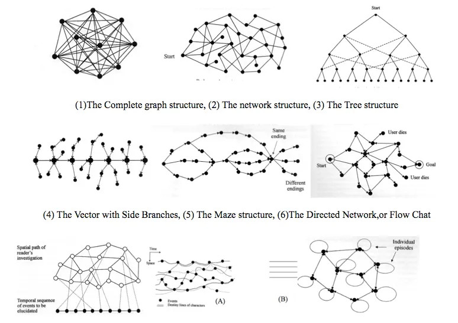{alt='narratives'}

### Traditional Linear Stories (Non-Interactive)
E-Books, Films, Documentaries, Oral stories (Audio Podcast etc...)

{alt='graph'}

- The user is not able to make the choice on how to proceed.

- Must follow all the events in line with the given narrative.

- The only possible interaction is play/pause/stop.

{alt='ebooks'}

 
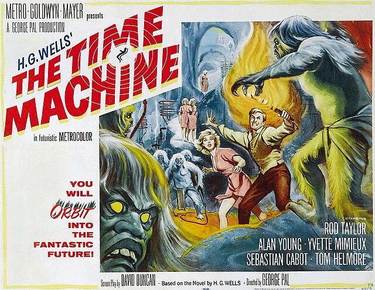{alt='time machine'}

{alt='audio'}

### Traditional Non-Linear Stories (Non-Interactive)
E-Books, Films, Documentaries

{alt='graph'}

- The user is not able to choose how to proceed.

- Must follow all the events in the narrative but with the presence of flash-backs and/or flash-forwards.

- Sometimes these experiences need to be repeated to understand the plot, like for example the film [Memento.](https://en.wikipedia.org/wiki/Memento_(film)){target="_blank" rel="noopener"}{alt='memento'}
 
{alt=''}

### Linear Stories (Interactive)

{alt='graph'}

The user is not able to choose the direction of the narrative but can interact with the contents. Can skip contents within the narrative.

{alt=''}

## Non-Linear Stories (Interactive)

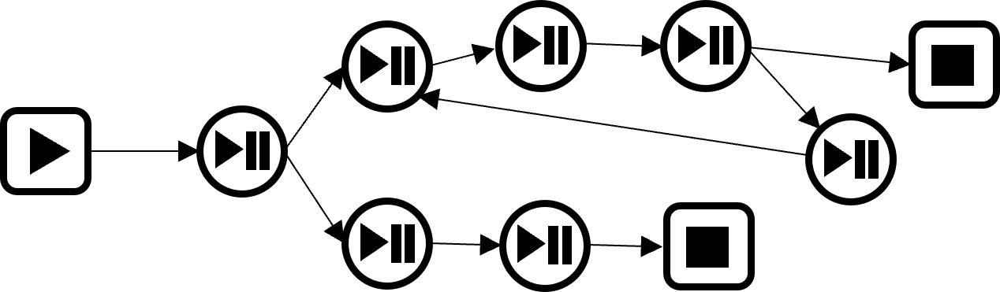{alt='graph'}

The user can make the choice on how to proceed.

{alt='headset'}

>"Black Mirror Bandersnatch is a very interesting concept. It gives you choices that start out simple like choosing a cereal box for breakfast and steadily moves towards darker decisions. You find yourself choosing who lives and dies and what to destroy and what to save. If we take a look at todays society, most people have become desensitized to so many different things. You are either numb to the world or sheltered from it. And this is the real point I think Bandersnatch is getting at. I found myself choosing bad decisions because I wanted to see how it would turn out. And I'm sure many other people did the same". *Comment by Nicolas A. on Twitter*

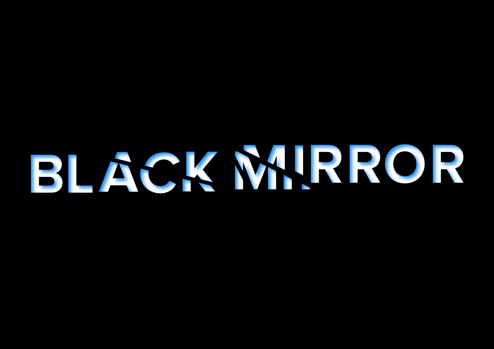{alt='black mirror'}

## More examples of Non-Linear narratives (Interactive)

### Multiple-ending stories
Usually, they have a well-defined beginning but can branch in different directions with the choice of different ending.

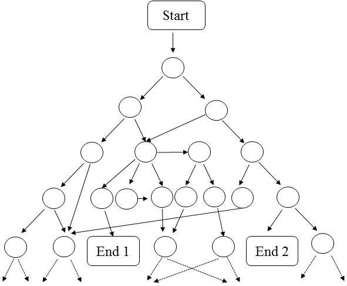{alt='graph'}

> "Some games in the Final Fantasy series have multiple or secret endings, the ending depending on the player's actions taken during the game. These can be as simple as minor adjustments to the final story scenes to reflect variable outcomes earlier in the game, or as drastic as entirely different conclusions to the story"
[https://finalfantasy.fandom.com/wiki/Multiple_endings](https://finalfantasy.fandom.com/wiki/Multiple_endings)

{alt='final fantasy'}

 
### Branch stories

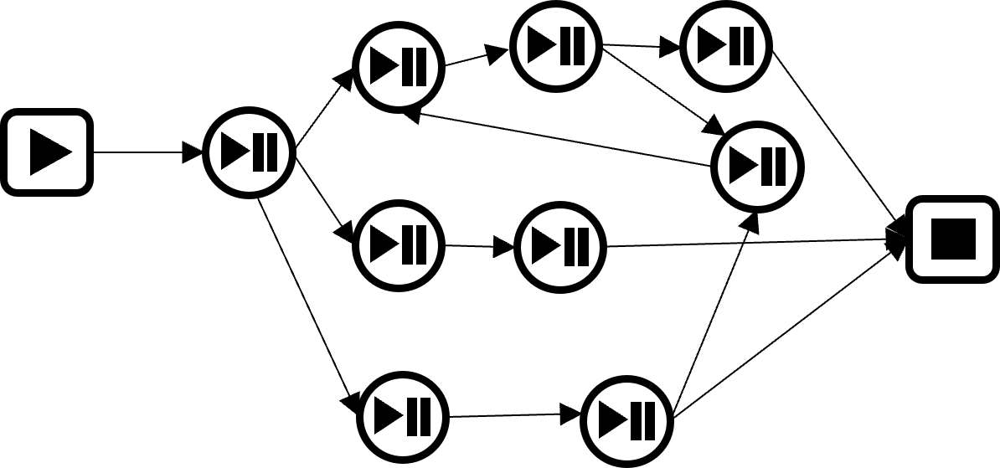{alt='graph'}

These types of stories branch in different directions but usually the have one ending, the user can make decision along the narrative.

The entire Dragon Age series offers you multiple occasions where they have to make a decision; these choices can be small and change next to nothing, or they can be large plot points that go on to echo in the rest of the sequels.

[https://www.thegamer.com/games-witch-branching-stories/#dragon-age-inquisition](https://www.thegamer.com/games-witch-branching-stories/#dragon-age-inquisition) 

.jpg){alt=''}

 
### Open ended stories

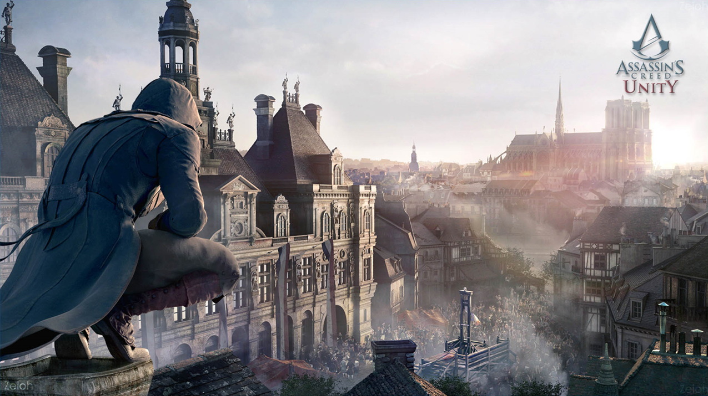{alt='graph'}

Can be all the above combined without a specific or well-defined ending. Sometime used in films for sequels.

.jpg){alt='creed'}

### Player driven stories (Open worlds)
> "People sometimes think "open-world" means an absence of narrative, just complete freedom of choice. But that’s not necessarily the case. In fact, it rarely is."

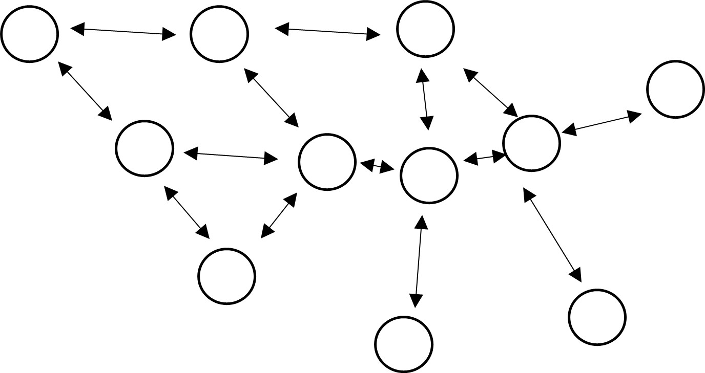{alt='graph'}

Examples:

- Avalon RPG Game
- Online Since 1984

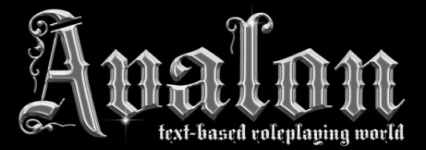{alt='logo'}

## Storytelling in Heritage Interpretation

>"...interpreters are charged with transforming a seemingly unmanageable amount of information into something suitable for the public."
[https://ncph.org/history-at-work/reinterpreting-freeman-tilden/](https://ncph.org/history-at-work/reinterpreting-freeman-tilden/)

The 6 Freeman Tilden principles from the book «Interpreting Our Heritage».

1. Any interpretation that does not somehow relate what is being displayed or described to something within the personality or experience of the visitor will be sterile. (who’s the audience?)
2. Information, as such, is not Interpretation. Interpretation is revelation based upon information. But they are entirely different things. However all interpretation includes information. (where’s the science?)
3. Interpretation is an art, which combines many arts, whether the materials presented are scientific, historical or architectural. Any art is in some degree teachable.
4. The chief aim of Interpretation is not instruction, but provocation. (what’s the story?)
5. Interpretation should aim to present a whole rather than a part, and must address itself to the whole man rather than any phase. (what’s the story?)
6. Interpretation addressed to children (say up to the age of twelve) should not be a dilution of the presentation to adults, but should follow a fundamentally different approach. To be at its best it will require a separate program. (who’s the audience?)
https://thesciencepresenter.wordpress.com/2011/01/24/6-principles-of-heritage-interpretation/ 

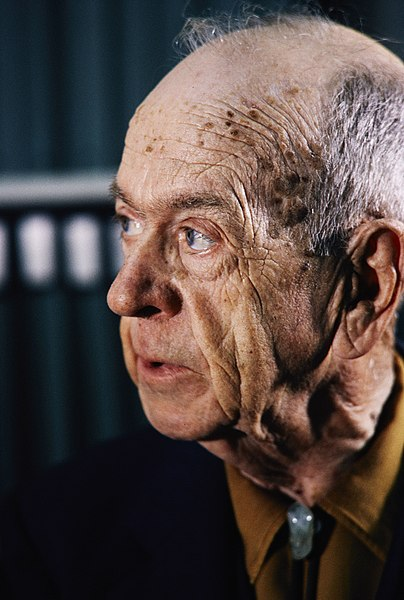{alt=''}

{alt=''}

## Digital Storytelling in Heritage Interpretation.

7 Tips on Digital Storytellinggiven by Europeana

1. Be Personal
2. Be informal but expert
3. Tell hidden stories
4. Illustrate your points
5. Signpost your journey
6. Be specific
7. Be evocative

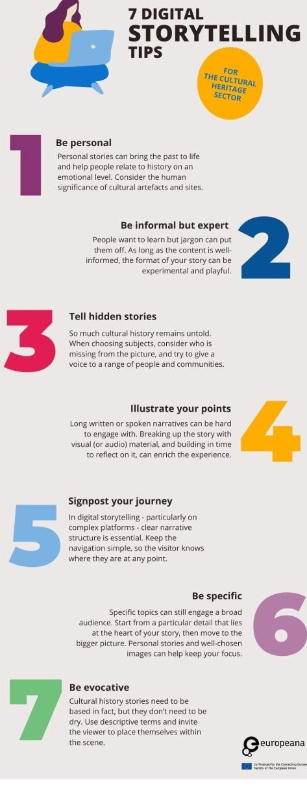{alt=''}

