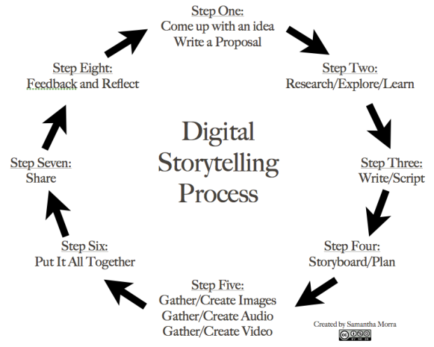

:::::::::::::::::::::::::::::::::::::: questions 

- How can storytelling support the engagement of audiences in a heritage context?

- What are the types of storytelling?

- What tools are available for creating stories in a heritage context?

::::::::::::::::::::::::::::::::::::::::::::::::
::::::::::::::::::::::::::::::::::::: objectives
- To understand the basic concept of storytelling.

- To understand the basic concept of Digital Storytelling.

- To understand the concept of Digital Storytelling in Heritage Interpretation.
:::::::::::::

## Domains of Interests and definitions 
There are  three main domains explored in this presentation and, although in this istance Storytelling is used to comunicate science the act of telling stories about scientific research can be consider as an art.

Storytelling  
- The art of telling stories in different formats (Oral, Films, Theatre, Dance, Writing, Multimedia, etc.. and any of these combined) 

Storytelling for Heritage Interpretation  
- The art of interpreting Heritage by telling stories

Digital Storytelling 
- The art of telling stories in digital formats 

Digital Storytelling in Heritage Interpretation 
- The art of telling stories in digital formats in heritage contexts

{alt='' width=100 height=100}

## Storytelling as human condition
As humans we communicate with stories. When we use the a narrative structure to communicate concepts we connect with our audience not only on a presentation level but also on intimate an personal level, because the audience can bond with the caracthers, the objects or the environments of the story.

> "Humans are natural storytellers. It has been THE FORM of passing on knowledge from generation to generation. Storytelling existed in some shape or form in all civilizations across time..."
>
- Tolisano, S.R. (2018). Digital Storytelling: What it is… And… What it is NOT. Langwitches.[https://langwitches.org/blog/2015/08/18/digital-storytelling-what-it-is-and-what-it-is-not/](https://langwitches.org/blog/2015/08/18/digital-storytelling-what-it-is-and-what-it-is-not/){target="_blank" rel="noopener"}

> Storytelling "is not just entertainment. Telling stories is a fundamental part of being human".
>
- Hennebury, C. (2020). Storytelling is not just entertainment. It's a fundamental part of being human. For CBC.[https://www.cbc.ca/news/canada/newfoundland-labrador/storytelling-is-human-1.5511027](https://www.cbc.ca/news/canada/newfoundland-labrador/storytelling-is-human-1.5511027 ){target="_blank" rel="noopener"}

![US Embassy from New Zealand by US Embassy New Zealand from Wikimedia Commons 

## What is storytelling?

> "Storytelling is the social and cultural activity of sharing stories, sometimes with improvisation, theatrics or embellishment.
Every culture has its own stories or narratives, which are shared as a means of entertainment, education, cultural preservation or instilling moral values."
>
- Chaitin J. (2003). Stories, Narratives, and Storytelling. Beyond Intractability. [https://www.beyondintractability.org/essay/narratives](https://www.beyondintractability.org/essay/narratives){target="_blank" rel="noopener"} 

{alt='campfire'}

## What is the use of storytelling?

Storytelling can be used as a tool for different purposes; however, it goes beyond a simple planned activity to become part of our individual and collective life experience. The uses of storytelling are in fact limitless. 

{alt='words'}

## Interactive storytelling in Literature
One of the first example of interactive storytelling in literature can be found in the series ["Choose your own adventure"](https://www.cyoa.com/){target="_blank" rel="noopener"} from Edward Packard. Here the reader can choose how to follow the narrative in a non-liner fashion and choosing the path of a multiple ending story. Those types of stories can be categorized also as [gamebooks](https://en.wikipedia.org/wiki/Gamebook){target="_blank" rel="noopener"}.

{alt='words'}

> Choose Your Own Adventure books were a series of kids gamebooks popular in the 1980s. They were written from a second-person point of view where the reader became the protagonist, making choices that would alter the story. The books would sell over 350 million copies through the 80s.
>
- Logie, J.(2020). The Story Behind the ‘Choose Your Own Adventure’ Books. Medium.[https://medium.com/everything-80s/the-story-behind-the-choose-your-own-adventure-books-be214f3d4bf4](https://medium.com/everything-80s/the-story-behind-the-choose-your-own-adventure-books-be214f3d4bf4){target="_blank" rel="noopener"} 

## From analogue to digital

> "...Digital Storytelling, has opened up new horizons, inconceivable without the use of technology. Storytelling is evolving, as humans are adapting, experimenting and innovating with the use of ever-changing technology, the growth of human networks and our ability to imagine new paths."
>
- Tolisano, S.R. (2018). Digital Storytelling: What it is… And… What it is NOT. Langwitches.[https://langwitches.org/blog/2015/08/18/digital-storytelling-what-it-is-and-what-it-is-not/](https://langwitches.org/blog/2015/08/18/digital-storytelling-what-it-is-and-what-it-is-not/){target="_blank" rel="noopener"}

 
{alt=''}

## What is (interactive) digital storytelling?

A definition for Digital Storytelling

> "...the practice of using computer-based tools to create short stories that can be shared online."
>
- Bernard R. Robin, Sara G. McNeil (2019). Digital Storytelling. Wiley Online Library. [https://onlinelibrary.wiley.com/doi/abs/10.1002/9781118978238.ieml0056](https://onlinelibrary.wiley.com/doi/abs/10.1002/9781118978238.ieml0056){target="_blank" rel="noopener"}

**also**

> It is *NOT* about creating media... it is about creating meaning.
>
- Tolisano, S.R. (2018). Digital Storytelling: What it is… And… What it is NOT. Langwitches.[https://langwitches.org/blog/2015/08/18/digital-storytelling-what-it-is-and-what-it-is-not/](https://langwitches.org/blog/2015/08/18/digital-storytelling-what-it-is-and-what-it-is-not/){target="_blank" rel="noopener"}

> It is *NOT* only (just) about telling a story... it is about contributing and collaborating with others
>
- Tolisano, S.R. (2018). Digital Storytelling: What it is… And… What it is NOT. Langwitches.[https://langwitches.org/blog/2015/08/18/digital-storytelling-what-it-is-and-what-it-is-not/](https://langwitches.org/blog/2015/08/18/digital-storytelling-what-it-is-and-what-it-is-not/){target="_blank" rel="noopener"}

### The Basic Steps of Digital Storytelling 

Samantha Morra proposes a storytelling cycle

{alt='cyclce'}

## Narrative vs Storytelling
"Narrative" and "Storytelling" are not two interchangable terms. While the term "narrative" usually relate to the part of the story that deal with its style and structure, the term "storytelling" involves not only the act of telling the story but also the relationship with the audience, the enviroment, the content and much more...

> "The term "storytelling" can refer specifically to oral storytelling but also broadly to techniques used in other media to unfold or disclose the narrative of a story."
>
- [https://en.wikipedia.org/wiki/Storytelling](https://en.wikipedia.org/wiki/Storytelling){target="_blank" rel="noopener"}

> "...the recent decades of this century have seen a tremendous development of diverse theories of narrative, so many and so diverse that it makes the mind ache to think of them all."
>
- Miller, J.H., 1990. "Narrative". In Lentricchia, F. & McLaughlin, T. eds., Critical Terms for Literary Study. Chicago, Illinois: The University of Chicago Press, pp. 66- 79.

In 2018, the Association for Research in Digital Interactive Narratives (ARDIN) was formed. [ARDIN](https://ardin.online/){target="_blank" rel="noopener"} supports research into Interactive Digital Narratives (IDN). **ICIDS (International Conference on Interactive Digital Storytelling)** is the main academic conference of ARDIN

