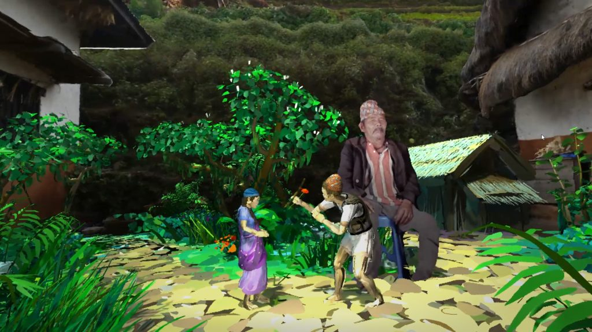

{alt='Kusunda'}

## Digital Storytelling
Visual Novel

- RenPy: [https://www.renpy.org/](https://www.renpy.org/)(https://www.renpy.org/){target="_blank" rel="noopener"}
- Tyrano Builder: [https://tyranobuilder.com/](https://tyranobuilder.com){target="_blank" rel="noopener"}

Branching narrative

- Yarn Spinner: [https://yarnspinner.dev/](https://yarnspinner.dev/){target="_blank" rel="noopener"}
- Twine: [https://twinery.org/](https://twinery.org/){target="_blank" rel="noopener"}
- Inklewriter: [https://www.inklestudios.com/inklewriter/](https://www.inklestudios.com/inklewriter/){target="_blank" rel="noopener"}
- Playfic: [https://playfic.com/](https://playfic.com/){target="_blank" rel="noopener"}

CMS and WEB

- Aesop Storyengine: [https://aesopstoryengine.com/](https://aesopstoryengine.com/){target="_blank" rel="noopener"} 
- Arcgis Storymaps: [https://storymaps.arcgis.com/](https://storymaps.arcgis.com/){target="_blank" rel="noopener"} 
- Odyssey: [https://cartodb.github.io/odyssey.js/](https://cartodb.github.io/odyssey.js/){target="_blank" rel="noopener"}

360

- Pano2VR: [https://ggnome.com/pano2vr/](https://ggnome.com/pano2vr/){target="_blank" rel="noopener"}
- Panoraven: [https://panoraven.com/en](https://panoraven.com/en){target="_blank" rel="noopener"}
- Orbix360: [https://orbix360.com/](https://orbix360.com/){target="_blank" rel="noopener"}
- Kula: [https://kuula.co/](https://kuula.co/){target="_blank" rel="noopener"}
- Klapty: [https://www.klapty.com/](https://www.klapty.com/){target="_blank" rel="noopener"}
- Matterport: [https://matterport.com/en-gb](https://matterport.com/en-gb){target="_blank" rel="noopener"}

VR/AR

- CenarioVR: [https://www.cenariovr.com/](https://www.cenariovr.com/){target="_blank" rel="noopener"}
- Iris VR: [https://irisvr.com/](https://irisvr.com/){target="_blank" rel="noopener"}
- SparkVR: [https://spark.meta.com/](https://spark.meta.com/){target="_blank" rel="noopener"}
- Vuforia Studio: [https://www.ptc.com/en/products/vuforia/vuforia-studio](https://www.ptc.com/en/products/vuforia/vuforia-studio){target="_blank" rel="noopener"}
- Layar: [https://www.layar.com/](https://www.layar.com/){target="_blank" rel="noopener"}
- Wikitude Studio: [https://www.wikitude.com/](https://www.wikitude.com/){target="_blank" rel="noopener"}
- TrainAR: [https://mixality.de/trainar/](https://mixality.de/trainar/){target="_blank" rel="noopener"}

Video

- Open-Hypervideo: [http://www.open-hypervideo.org/](http://www.open-hypervideo.org/){target="_blank" rel="noopener"}
- Davinci Resolve: {target="_blank" rel="noopener"}

2d/3d Games and 3D real-time film

- Belender: [https://www.blender.org/](https://www.blender.org/){target="_blank" rel="noopener"}
- Unreal Engine: [https://www.unrealengine.com/](https://www.unrealengine.com/){target="_blank" rel="noopener"} 
- Unity: [https://unity.com/](ttps://unity.com/){target="_blank" rel="noopener"}
- Twinmotion: [https://www.twinmotion.com](https://www.twinmotion.com){target="_blank" rel="noopener"}
- Alice: [http://www.alice.org](http://www.alice.org){target="_blank" rel="noopener"}
- Visionare Studio: [https://www.visionaire-studio.net/](https://www.visionaire-studio.net/){target="_blank" rel="noopener"}
- Adventure Maker: [http://www.adventuremaker.com/](http://www.adventuremaker.com/){target="_blank" rel="noopener"}
- Adventure Game Studio [https://www.adventuregamestudio.co.uk/](https://www.adventuregamestudio.co.uk/){target="_blank" rel="noopener"}

## Digital Storytelling in heritage context, museums and exhibitions
- Narralive: [https://www.narralive.org/story-maker/](https://www.narralive.org/story-maker/){target="_blank" rel="noopener"}
- Terrastories: [https://terrastories.app/](https://terrastories.app/){target="_blank" rel="noopener"}
- Voyager Story Standalone: [https://3d.si.edu/voyager-story-standalone](https://3d.si.edu/voyager-story-standalone){target="_blank" rel="noopener"}
- Curio Publisher: [https://www.curiopublisher.com/](https://www.curiopublisher.com/){target="_blank" rel="noopener"}
- Aton Framework: [https://osiris.itabc.cnr.it/aton/](https://osiris.itabc.cnr.it/aton/){target="_blank" rel="noopener"}
- CHESS CAT: [https://chessexperience.eu/](https://chessexperience.eu/){target="_blank" rel="noopener"}

The following tools leverage the interoperability offered by IIIF:

- Recogito: [https://recogito.pelagios.org/](https://recogito.pelagios.org/){target="_blank" rel="noopener"}
- Digital Mappa:[https://www.digitalmappa.org/](https://www.digitalmappa.org/){target="_blank" rel="noopener"}
- Allmaps: [https://allmaps.org/](https://allmaps.org/){target="_blank" rel="noopener"}
- Annona: [https://ncsu-libraries.github.io/annona/](https://ncsu-libraries.github.io/annona/){target="_blank" rel="noopener"}
- Adno: [https://adno.app/en/](https://adno.app/en/){target="_blank" rel="noopener"}
- Exhibit: [https://www.exhibit.so/](https://www.exhibit.so/){target="_blank" rel="noopener"}
- Micrio: [https://doc.micr.io/iiif/](https://doc.micr.io/iiif/){target="_blank" rel="noopener"}
- MLOL: [https://iiif.medialibrary.it/stories/](https://iiif.medialibrary.it/stories/){target="_blank" rel="noopener"}
- Omeka: [https://omeka.org/s/modules/IiifServer/](https://omeka.org/s/modules/IiifServer/){target="_blank" rel="noopener"}
- Spotlight: [http://projectblacklight.org/](http://projectblacklight.org/){target="_blank" rel="noopener"}
- Storiiies Editor: [https://storiiies-editor.cogapp.com/](https://storiiies-editor.cogapp.com/){target="_blank" rel="noopener"} 
- Strollview: [https://seige.digital/en/strollview/](https://seige.digital/en/strollview/){target="_blank" rel="noopener"}
- Wax: [https://minicomp.github.io/wax/](https://minicomp.github.io/wax/){target="_blank" rel="noopener"}

References:

- Popular IIIF Tools. IIIF. [https://iiif.io/get-started/tools/](https://iiif.io/get-started/tools/){target="_blank" rel="noopener"}

- M. Massidda, L. Travaglini, S. Pescarin (2023). Interactive Digital Narrative Authoring Tools and Hybrid Experiences in Cultural Heritage: An integrated review[Conference presentation]. EUROGRAPHICS Workshop on Graphics and Cultural Heritage (2023), Lecce, IL, Italy. [https://diglib.eg.org/bitstream/handle/10.2312/gch20231155/031-035.pdf](https://diglib.eg.org/bitstream/handle/10.2312/gch20231155/031-035.pdf)

